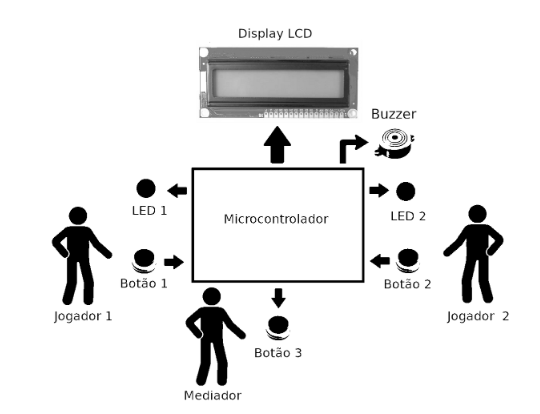

# Final Project - SBL0082 - MICROPROCESSADORES

This repository contains all the code and schematics for the final project of the course SBL0082, from the Computer Engineering course at the Federal University of Ceará.

Esse repositório  contém todo o código e esquemáticos para o projeto final da disciplina SBL0082, do curso de Engenharia de Computação da Universidade Federal do Ceará.

## Descrição do Projeto

Implementar o sistema a microprocessador ilustrado, que consiste em um jogo de teste de reflexos, conforme a seguinte especificação:

- Estado inicial: Aguarda ação do mediador com os LEDs e Display LCD apagados;
- Passo 1. Mediador pressiona o Botão 3;
- Passo 2. Em resposta, o Buzzer emite som de 500 milisegundos de duração;
- Passo 3. Jogadores reagem ao sinal do Buzzer pressionando os seus respectivos botões;
- Passo 4. Em resposta, o LED do jogador que pressionou primeiro o botão acende;
- Passo 5. O Display LCD mostra os tempos de reação de cada jogador, em milisegundos;
- Passo 6. Aguarda o mediador pressionar o Botão 3;
- Passo 7. Em resposta, retorna ao Estado inicial;

